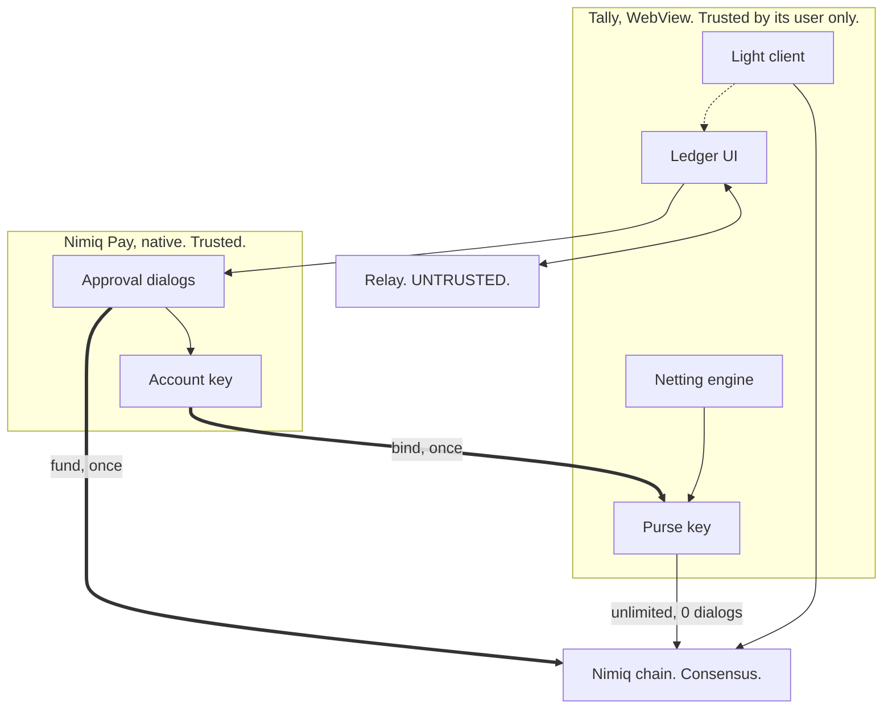
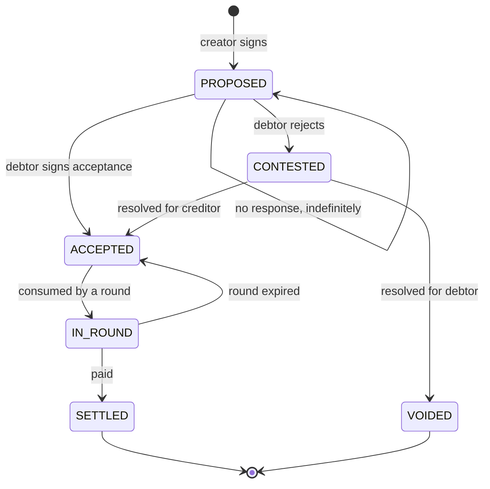
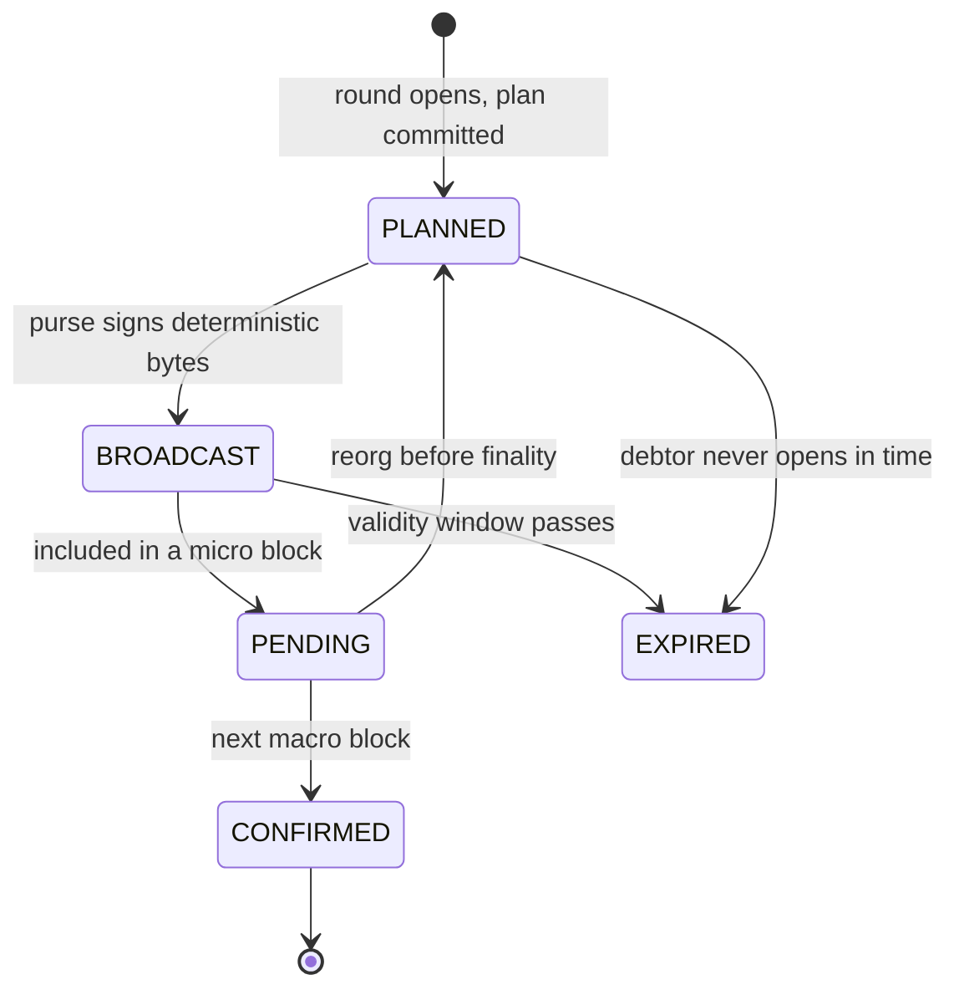
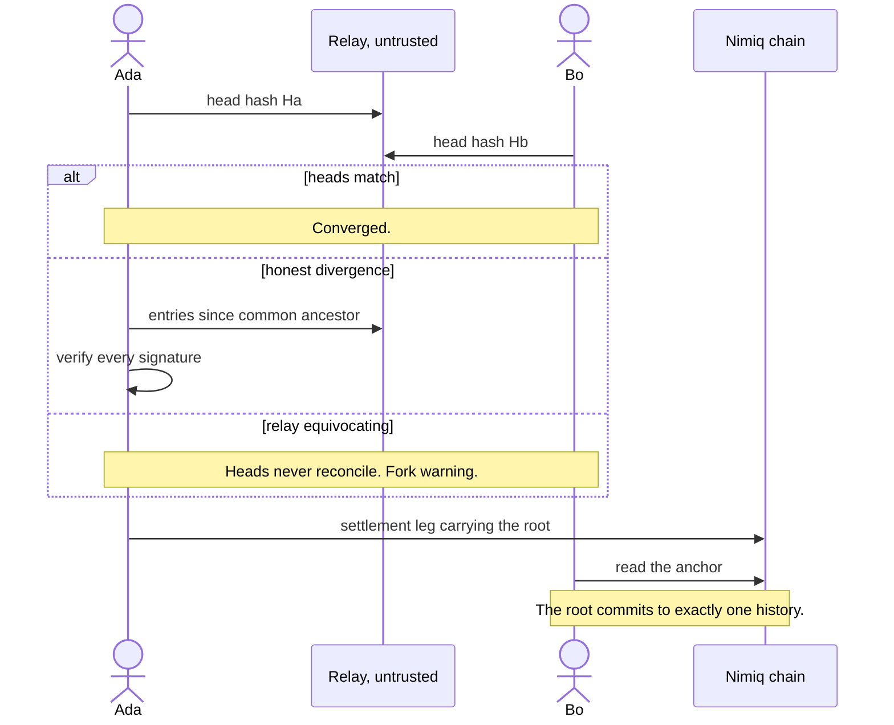

# Architecture

## The constraint everything follows from

Nimiq has no general-purpose VM. It has native HTLC, vesting and staking contract types at protocol level, but a mini app can't create or redeem any of them: the provider exposes no arbitrary transaction signing, no raw transaction signing, and no contract-creation flag. Any design needing escrow enforcement, conditional release or programmable custody isn't buildable here.

That single fact removes most of the obvious answers. What's left has to work with plain transfers, a 64-byte data field, and signatures.

The second constraint is subtler. Every state-changing provider call opens a native dialog the app can't suppress. Gas is free and blockspace is free, so the scarce resource isn't money, it's **user taps**. The architecture is organised around making one confirmation buy a large amount of subsequent verifiable action.

## System shape



The two thick edges are the only times the account key is used in normal operation. Everything after them is the purse acting alone, which is the architectural bet.

Trust boundaries: the chain is the only thing that settles disputes. The relay is assumed hostile and every response is re-verified locally. The WebView is trusted by its own user and nobody else, which is why a purse can only ever pay its owner's leg.

## Packages

| Package | Owns | Invariant it protects | Refuses to |
| --- | --- | --- | --- |
| `core/netting` | Pairwise collapse, cycle cancellation, greedy minimisation | Net positions sum to exactly `0n`; at most `n-1` transfers; no self-transfer; no zero or negative amount | Touch a float, or depend on input order |
| `core/anchor` | The wire format and the root chain | An anchor is 50 to 54 bytes and never exceeds 64; decode rejects malformed input rather than guessing | Truncate silently |
| `core/log` | Signed append-only entries, replay, fork detection | An obligation enters netting only on the debtor's own signed acceptance; every entry's purse key matches the one registered at join | Accept an entry it can't verify, or drop one silently |
| `core/tx` | Deterministic transaction construction, purse derivation | Every field is derived from the log, never observed at broadcast time | Build a leg for a purse that doesn't own it |
| `core/binding` | Purse-to-account attestation | A registered member controls the account their purse is bound to | Accept a small-order key, or an unverified attestation |
| `app` | Screens, adapters, flows | State is derived from the log and never stored twice | Trust the relay or the cache |
| `relay` | Store and forward | Nothing. It's untrusted | Forge, because it holds no keys |

## State machines



Silence is never consent. A proposed obligation sits untouched forever and never moves a Luna.



Nothing displays as settled before `CONFIRMED`. Finality is the macro block at the end of a batch, roughly one minute, not the one-second micro block. `PENDING` shows as sending, with the block countdown visible.

## Deterministic transaction construction

This is the part that prevents double payment, and it's worth being precise about the failure it avoids.

A purse key exists only on its owner's device, so no participant can sign anyone else's transfer and there's no cross-participant race. The real risk is one purse broadcasting its own leg twice, from a retry, a refresh, or the same account open on two devices.

Checking recent transactions before sending does not fix this. Both devices can read before either transaction lands, both conclude no duplicate exists, and both pay. It passes casual testing and fails in the field.

The fix is byte-for-byte determinism. Every field is derived, never observed:

| Field | Source |
| --- | --- |
| sender | The payer's purse address |
| recipient | The settlement plan (the creditor's account, not their purse) |
| value | The settlement plan |
| fee | `0n`, always |
| data | The anchor string |
| validityStartHeight | **The round's anchor height, read from the signed log** |

Ed25519 signing is deterministic, so identical content signed by the same key produces an identical signature and an identical transaction hash. Two devices building the same leg produce the same transaction, and the second broadcast is a re-broadcast that the mempool discards on hash.

`validityStartHeight` is the field that breaks this if handled carelessly. It cannot be read from the chain at broadcast time, because two devices reading three blocks apart produce different bytes and therefore two real payments. It's recorded once in the round's opening entry, derived from the block height that the triggering acceptance already recorded, and every device reads the same value from the shared log.

The same reasoning forced two later fixes, both found by adversarial review. A round must pin its **participant set** and its **consumed obligations** when it opens, because otherwise a member joining mid-round, or an acceptance arriving late with a lower logical clock, silently changes the committed plan and the same leg signs to different bytes. Both are covered in [REVIEWS.md](REVIEWS.md).

## The wire format

```
TLY1.<ledger8>.<round4>.<i>/<n>.<root27>
```

| Field | Bytes | Encoding |
| --- | --- | --- |
| `TLY1` | 4 | Magic and version |
| `ledger8` | 8 | Base32 of the first 5 bytes of the ledger genesis hash |
| `round4` | 4 | Base32 round counter, about 20 bits of headroom |
| `i/n` | 3 to 7 | Transfer index within the round |
| `root27` | 27 | Base64url of a 160-bit truncated Blake2b |
| separators | 4 | `.` |
| **Total** | **50 to 54** | 10 to 14 bytes of headroom under the 64-byte limit |

The index field grows past 3 bytes for rounds with 10 or more legs, which is why the total is a range rather than the flat 50 the PRD quotes. The encoder asserts the result never exceeds 64 bytes and throws rather than truncating.

160 bits gives 128-bit second-preimage resistance, which is the property that matters: an adversary would have to grind a different history hashing to a specific published root.

## Log transport and equivocation

One signed append-only log per ledger. Each entry carries `prevEntryHash`, type, payload, author address, purse public key and signature. The entry ID is content-derived, so duplicates collapse on arrival rather than needing detection, and the log is content-addressed so a single head hash identifies the whole history.

Replay sorts by `(logicalClock, entryId)`, making derived state independent of arrival order. Contextually invalid entries are skipped deterministically and recorded, never silently dropped.

The relay retains exactly two powers: omission and reordering. It can't forge an entry, alter one, or attribute one to somebody who didn't sign it.



Equivocation is **detected, not prevented**, on the certificate transparency model. A backend showing Alice one history and Bob another gets caught by head-hash comparison within seconds, and permanently by settlement-time reconciliation against the on-chain root. Members can also export the signed log and compare out of band, needing no cooperation from Tally.

## Chain reads

RPC-first for reads, light client for verification. The light client is lazy-loaded and never blocks first paint, because the WASM bundle is several megabytes and the 60-second onboarding target is scored.

Phase 0 enumerated the public testnet endpoint's method allowlist, because a blocked history method would have made the light client mandatory and changed this design substantially. The result:

| Method | Permitted |
| --- | --- |
| `getBlockNumber` | Yes |
| `getAccountByAddress` | Yes |
| `getTransactionsByAddress` | Yes |
| `getTransactionHashesByAddress` | Yes |
| `getTransactionByHash` | Yes |
| `sendRawTransaction` | Yes |
| `getHeadBlock` | **No**, returns "Method not allowed" |

The discriminator matters: a blocked method returns `Method not allowed`, while an allowed one called imperfectly returns a params or serialization error. Address history is available, so RPC serves the hot path and the light client stays a verification layer.

`getTransactionsByAddress(address, max, startAt)` takes three positional parameters, confirmed against the `core-rs-albatross` source rather than the docs. The endpoint is rate limited, so the app coalesces requests, backs off on 429, keeps one poll loop per app instance rather than per ledger, and never polls while backgrounded.
