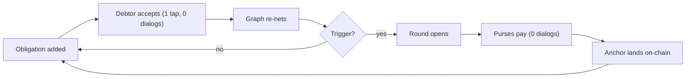
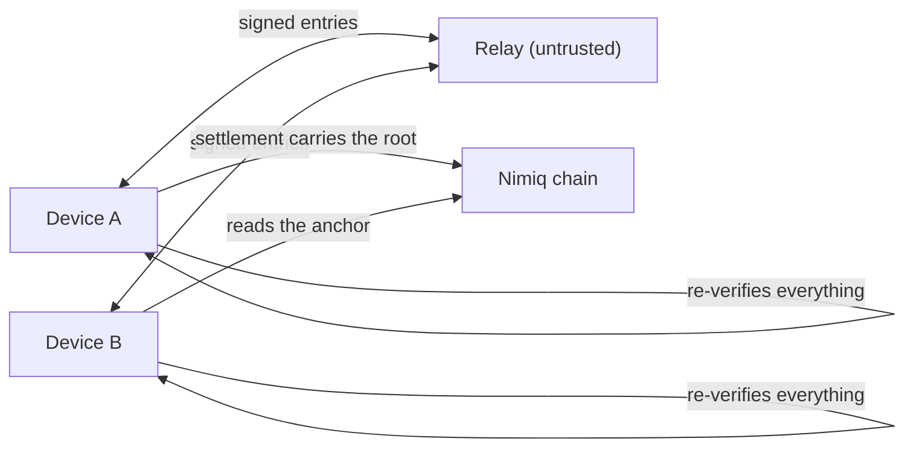

# Tally

**Top up once. Stop settling up.**

A shared ledger of obligations among 2–12 people that nets continuously, clears
in NIM without a payment prompt per transfer, and anchors every settlement to an
append-only on-chain record. Built for the Nimiq Pay Mini Apps competition.

> Testnet only in development. Public from the first commit — all history is
> public. MIT licensed.

## How it works



Three mechanisms carry the product:

- **Netting** collapses pairwise debts, cancels cycles exactly, then greedily
  matches largest debtor to largest creditor — at most n−1 transfers, computed
  identically on every device. Whoever nets to zero drops out of the round.
- **The purse** is a session key derived from one wallet signature. It signs the
  log (every mode) and, once funded, pays settlements with no dialog (auto
  mode). It is a disclosed hot key — see [SECURITY.md](SECURITY.md).
- **Anchoring** rides a 50-byte commitment in each settlement's data field, a
  hash chain so rewriting any past obligation breaks every anchor after it.

## Monorepo

| Package | What it is | Status |
| --- | --- | --- |
| [`packages/core`](packages/core) | Pure engine: netting, anchor, signed log, deterministic tx, purse↔account binding. Zero DOM/network/wallet. | ✅ built, 82 tests, reviewed |
| [`packages/relay`](packages/relay) | Untrusted log transport (Cloudflare Workers + D1). | ✅ built, 8 tests, reviewed |
| [`packages/app`](packages/app) | Mini app + landing, one origin. | 🚧 shell + state layer + landing built (20 tests); full flow UI in progress |

## The two things that make it work

**Determinism is the product.** Two devices holding the same obligation set
produce byte-identical plans and transactions, so a duplicate broadcast is a
mempool re-broadcast — not a second payment. The round's anchor height is
derived from the log (never observed at open time), or two devices would fork.

**The relay is untrusted.**



It can omit, reorder, or go down; it cannot forge. Every entry is signed by a
purse key bound to a real account (verified by the [binding
attestation](packages/core/core/binding)), and clients re-verify every entry.

## Development

```sh
pnpm install
pnpm -r test        # vitest + fast-check, 110 tests
pnpm -r typecheck
pnpm --filter @tally/app dev     # one origin; ?app=1 forces the app half
pnpm --filter @tally/relay dev   # the relay
```

## Ground rules

- **Testnet only** until release; both networks at submission. Ledgers are
  network-scoped.
- **BigInt Luna everywhere** (1 NIM = 100,000 Luna). A float touching an amount
  is a bug.
- **Everything degrades to something usable, never a blank screen.** Declined
  dialog, dead relay, lost consensus, rate limit — each has a designed state.

## Honest limitations

See [SECURITY.md](SECURITY.md) for the full security model. In short: the purse
is a disclosed hot key whose balance is the entire risk; on-chain anchors prove
internal consistency and prevent silent rewrites but need the exported signed
log for full audit; nobody can be forced to settle; and member registration is
trust-on-first-use ([issue #1](https://github.com/winsznx/tally/issues/1)).
