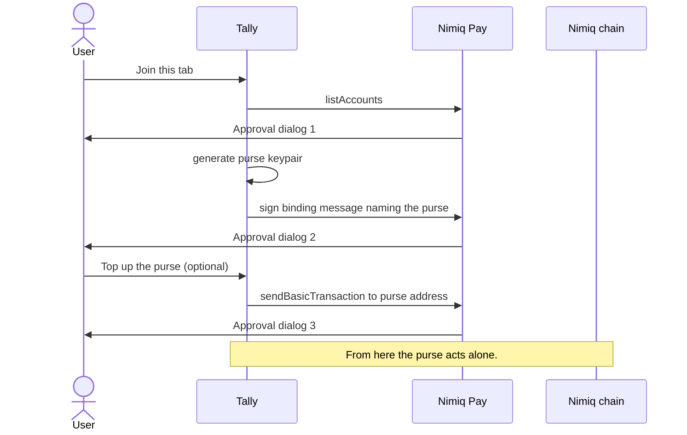
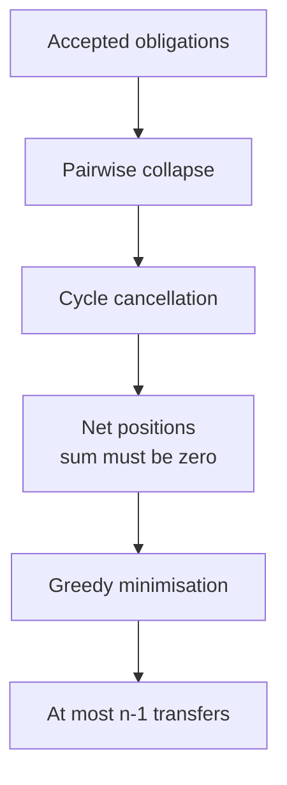
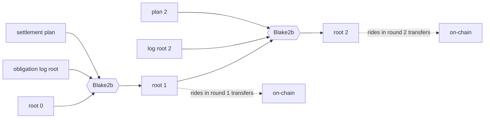

# Tally

Keep a running tab with your people, and stop approving payments.

**[Live demo](https://tally-646.pages.dev)** · [Architecture](ARCHITECTURE.md) · [Decisions](DECISIONS.md) · [Security](SECURITY.md) · [Reviews](REVIEWS.md)

A Nimiq Pay Mini App. Testnet.

## The problem

Bill splitting apps produce a list saying X owes Y 2,400, and then nothing happens. The debt sits there. Nobody pays, because moving small amounts costs fees, takes minutes, and needs everyone online on the same rail at once.

The tracking was never the problem. The settling is.

## What Tally does

It takes a graph of who owes whom, computes the smallest set of transfers that clears it, and executes them without asking for a confirmation per payment.

Four friends, five debts, from the PRD's worked example:

```
Ada owes Bo    500        Ada owes Dee  1200
Bo  owes Cy    500        Bo  owes Dee   300
Cy  owes Ada   500
```

Ada, Bo and Cy owe each other in a circle. That circle cancels exactly, and no money moves for it. What's left:

```
Ada  ->  Dee   1200
Bo   ->  Dee    300
```

Five obligations become two transfers, and Cy nets to zero and drops out of the round entirely, so Cy never opens the app at all. That second effect is what a transfer count hides: netting reduces how many people have to show up, not just how many payments happen.

`pnpm --filter @tally/core test` covers this exact example as a fixed regression, asserting two transfers and Cy's absence.

## Why this only works on Nimiq

Auto-settling small amounts on a fee-bearing chain means holding a gas token and pre-approving spends before anything can move on your behalf. Ask someone to keep POL topped up so their share of dinner settles itself and you've lost them. The mechanic doesn't survive contact with gas.

Nimiq transfers are feeless, so clearing a 3 NIM debt is worth doing at all. Where the fee exceeds the debt, small automatic settlement is pointless, which is why nobody builds it there.

Anchoring is free too. Each settlement transfer carries its round's commitment in its own 64-byte data field, so the audit trail rides along with the payment instead of costing a second transaction.

We considered settling in USDT and rejected it. Gas kills the premise, and asking a non-crypto person to hold two tokens to split a taxi fare is worse than the problem. That's a design position, not an omission. [DECISIONS.md](DECISIONS.md) lists everything rejected and why.

## How it works

### The purse

Joining a tab takes two approvals: one to choose which of your addresses is you, and one to sign the message binding an app-generated key, the purse, to that account. Both are structural. The log requires an attested purse from a member's first entry, and the message has to name the purse, which is only known once it exists. Funding the purse is a third approval, and it is optional forever.



The purse has two jobs. It signs log entries, which every mode uses and which risks nothing. It also holds NIM and broadcasts settlements with no dialog, which only auto-settle mode uses. Manual mode disables the second job only: same netting, same anchoring, same audit trail, one dialog per payment. Skipping the purse costs taps, not features.

The binding proves which account a purse speaks for, and replay rejects any member whose attestation doesn't verify.

### The netting engine



Cycle cancellation is exact, and removes debt without moving money. The zero-sum check runs on every execution in production, not just in tests. Greedy minimisation matches the largest debtor to the largest creditor directly, so every transfer goes debtor to creditor with no intermediary hops, and nobody's payment waits on a third person.

### The anchor chain

Each round's commitment chains to the one before it:



Change one obligation in round 1 and root 1 changes, which changes every root after it. Those roots already sit in transfers that already settled and can't be recalled. Tally's backend can't quietly revise what you owed last month, because the money that already moved commits to the old history.

## What it doesn't do

**Nothing runs while the app is closed.** Mini apps have no background worker, no push channel, and no hosted signer. A purse is live only while Tally is open, so settlement happens when you open the app, not on a schedule. Any copy suggesting otherwise would be false.

**Verification needs the exported log.** Anchors prove a round's transfers are complete, correctly indexed and consistent with a committed plan. They can't prove the obligations behind them were real. A full audit needs the signed log alongside the chain data, which any member can export.

**The purse is a hot key.** It lives in WebView storage, and its balance is the entire security boundary. That bound is protocol-level and absolute. It's a cash drawer, not a vault, and the app says so before anyone funds it.

**The chain proves settlement, not truth.** It shows money moved between specific addresses in a pattern matching a committed plan. It can't show dinner happened or that the split was fair.

**Nobody can be forced to settle.** With no contract enforcement available, a member who never funds their purse simply doesn't pay. What Tally produces is permanent, public, attributable evidence of who didn't. That's social pressure, and calling it stronger would be dishonest.

## Running it

Needs Node 20+ and pnpm.

```sh
pnpm install
pnpm -r test          # vitest + fast-check
pnpm -r typecheck
pnpm --filter @tally/app dev     # one origin, ?app=1 forces the app half
pnpm --filter @tally/relay dev   # the relay
```

Deploying to Cloudflare is `npx wrangler login` then `./scripts/deploy.sh`. See [DEPLOY.md](DEPLOY.md). There are no secrets in this repository and none are needed, which is a deliberate property explained there.

To record a demo without recruiting three people, `pnpm seed:demo --dee <your address>` creates Ada, Bo and Cy as real cryptographic members with the obligations above, and prints an invite link.

## Repo map

| Package | What it owns | Why it exists |
| --- | --- | --- |
| `packages/core` | Netting, anchor format, signed log, deterministic transactions, binding attestation | Pure modules with no DOM and no network, so the rules that move money are testable without a phone |
| `packages/app` | Mini app, landing page, adapters, screens | One origin serves both halves. External dependencies sit behind interfaces so flows run against fakes |
| `packages/relay` | Cloudflare Worker plus D1 | Stores and forwards signed entries. Untrusted by design: it can omit, reorder or go down, and it cannot forge |

## Documents

[ARCHITECTURE.md](ARCHITECTURE.md) for the engineering. [DECISIONS.md](DECISIONS.md) for what was rejected. [SECURITY.md](SECURITY.md) for the threat model. [REVIEWS.md](REVIEWS.md) for the bugs adversarial review found. [DEPLOY.md](DEPLOY.md) to ship it.

MIT licensed.
